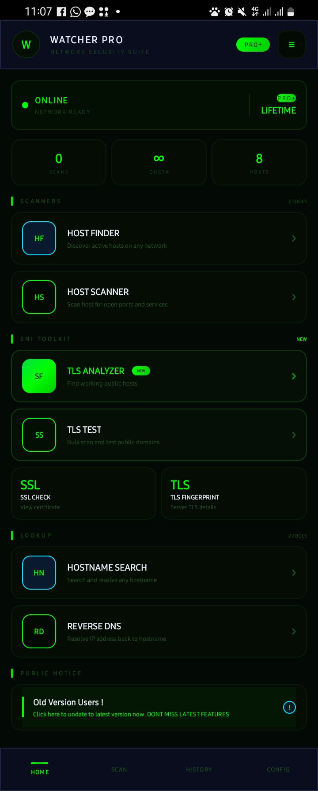
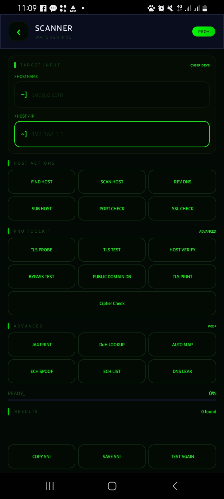

# 🛡️ WATCHER PRO — Network Security Suite

<p align="center">
  
  
</p>

<p align="center">
  
  
  
  
</p>

> **WatcherPro** is a professional-grade Android network security suite built for security researchers, penetration testers, and network engineers. Packed with advanced TLS/SNI analysis, host discovery, DNS intelligence, and ECH detection tools — all in a clean, dark cyber UI.

---

## 📱 Screenshots

| Home | Scanner | Advanced |
|------|---------|----------|
|  |  | Coming soon |

---

## ✨ Features

### 🔍 Scanners
| Tool | Description |
|------|-------------|
| **Host Finder** | Discover all active hosts on any network range |
| **Host Scanner** | Deep scan a host for open ports and running services |

---

### 🔐 SNI / TLS Toolkit
| Tool | Description |
|------|-------------|
| **TLS Analyzer** | Find working public TLS hosts — SNI fingerprint analysis |
| **TLS Test** | Bulk scan and test multiple public domains simultaneously |
| **TLS Probe** | Probe a hostname's full TLS handshake and certificate chain |
| **TLS Print** | Print full TLS server details and negotiated parameters |
| **Host Verify** | Verify if a hostname responds correctly to TLS requests |
| **Bypass Test** | Test how a host responds to various TLS bypass techniques |
| **Public Domain DB** | Query built-in database of known public TLS hosts |
| **Cipher Check** | Enumerate all TLS ciphers supported by a target host |
| **SSL Check** | View and analyze the full SSL/TLS certificate of any host |
| **TLS Fingerprint** | Extract and display detailed server TLS parameters |

---

### 🌐 Lookup Tools
| Tool | Description |
|------|-------------|
| **Hostname Search** | Resolve and analyze any hostname — A, AAAA, CNAME, MX records |
| **Reverse DNS** | Resolve an IP address back to its hostname (PTR lookup) |

---

### ⚡ Advanced (PRO+)
| Tool | Description |
|------|-------------|
| **JA4 Print** | Generate JA4 TLS fingerprints for client/server identification |
| **DoH Lookup** | DNS over HTTPS resolver — bypass standard DNS for privacy |
| **Auto Map** | Automatically map all hosts and services on a target network |
| **ECH Spoof** | Test Encrypted Client Hello spoofing on target hosts |
| **ECH List** | Enumerate domains with ECH (Encrypted Client Hello) support |
| **DNS Leak** | Check if your VPN or connection is leaking real DNS queries |

---

### 🖥️ Host Actions (Scanner Module)
| Action | Description |
|--------|-------------|
| **Find Host** | Quick host discovery and resolution |
| **Scan Host** | Full port and service scan on target |
| **Rev DNS** | Reverse DNS lookup on target IP |
| **Sub Host** | Subdomain discovery on target hostname |
| **Port Check** | Check specific ports on target host |
| **SSL Check** | Full SSL certificate inspection |

---

## 🚀 How To Use

### Basic Host Check
```
1. Open Scanner
2. Enter hostname (e.g. google.com) in HOSTNAME field
3. Enter IP in HOST/IP field (optional)
4. Tap FIND HOST → see resolved IP and host status
5. Tap SCAN HOST → see open ports and services
```

### TLS / SNI Analysis
```
1. Open Scanner → SNI Toolkit section
2. Enter target hostname
3. Tap TLS PROBE → full TLS handshake analysis
4. Tap SSL CHECK → view full certificate details
5. Tap TLS PRINT → see negotiated TLS parameters
6. Tap CIPHER CHECK → enumerate supported ciphers
```

### Advanced ECH / JA4 (PRO+)
```
1. Enter target hostname
2. Tap JA4 PRINT → generates JA4 fingerprint
3. Tap ECH LIST → checks if host supports ECH
4. Tap ECH SPOOF → tests ECH spoofing response
5. Tap DoH LOOKUP → resolves via DNS over HTTPS
```

### DNS Leak Test
```
1. Connect to your VPN
2. Open Scanner → Advanced section
3. Tap DNS LEAK
4. App will detect if real DNS is leaking
```

### Network Scanner
```
1. Open Home → Host Finder
2. Enter IP range (e.g. 192.168.1.1 to 192.168.1.255)
3. Tap FIND HOSTS
4. All active hosts on network will be listed
```

---

## 📊 Dashboard

The home screen shows real-time stats:
- **SCANS** — Total scans performed this session
- **QUOTA** — Remaining scan quota (∞ for PRO+)
- **HOSTS** — Total hosts discovered
- **ONLINE indicator** — Live network connectivity status

---

## ⚙️ Requirements

- Android 6.0+ (API 23+)
- Internet permission
- Network access permission

---

## 📦 Installation

1. Download the latest APK from [Releases](../../releases)
2. Enable "Install from unknown sources" on your device
3. Install the APK
4. Launch WatcherPro

---

## ⚠️ Legal Disclaimer

> This tool is developed for **educational purposes and authorized security research only**.
> Only use WatcherPro on networks and systems you own or have **explicit written permission** to test.
> The developer is not responsible for any misuse of this tool.
> Always comply with your local laws and regulations.

---

## 👨‍💻 Developer

**CYBER DEVS**
- Built with Java
- Android Network Security Research
- Zimbabwe 🇿🇼

---

## 📄 License

This project is licensed under the MIT License — see the [LICENSE](LICENSE) file for details.

---

<p align="center">
  <b>WATCHER PRO — See Everything. Miss Nothing.</b>
</p>
